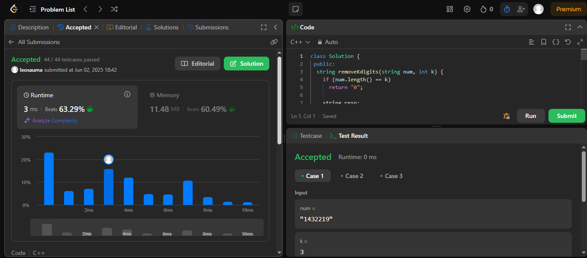
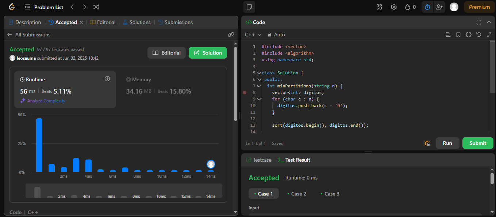
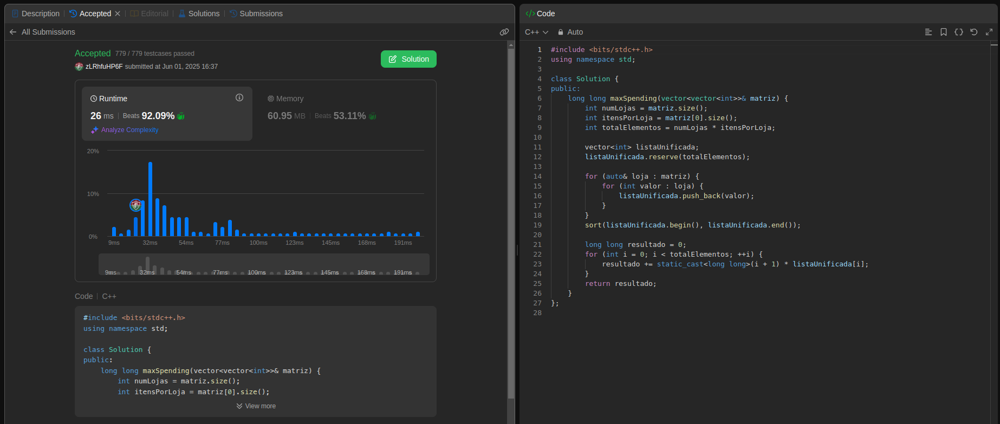
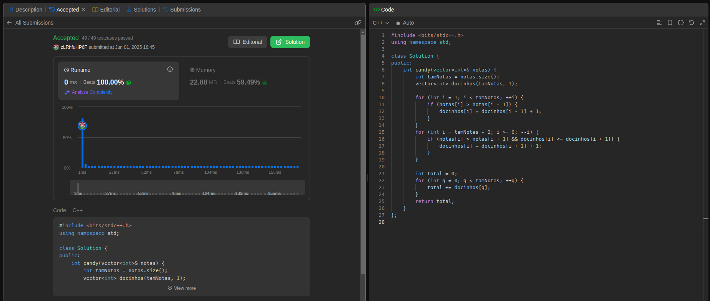

# GreedyLeetCode
# Exercícios LeetCode

- **Número da Lista**: 3 <br>
- **Conteúdo da Disciplina**: Algoritmos Ambiciosos (Greedy Algorithms) <br>
- [**Vídeo da Apresentação**](https://youtu.be/FxIUeXooav0) <br>

## Alunos
|Matrícula | Aluno |GitHub|
| -- | -- | -- |
| 23/1035428  | Leonardo Henrique Sobral Sauma Junior |[leohssjr](https://github.com/leohssjr)|
| 23/1011426  | Gustavo Gontijo Lima |[Guga301104](https://github.com/guga301104)|

## Sobre 
Este repositório tem como objetivo a resolução de exercícios sobre grafos do [LeetCode](https://leetcode.com/), utilizando o conteúdo de Algoritmos Ambiciosos (Greedy Algorithms) da disciplina Projeto de Algoritmos, sendo 1 de nível médio e 3 de nível difícil.

|Exercício | Dificuldade |
| -- | -- |
|[402](https://leetcode.com/problems/remove-k-digits/description/)|🟡 Médio|
|[1689](https://leetcode.com/problems/partitioning-into-minimum-number-of-deci-binary-numbers/description/)|🔴 Difícil|
|[2931](https://leetcode.com/problems/maximum-spending-after-buying-items/description/)|🔴 Difícil|
|[135](https://leetcode.com/problems/candy/description/)|🔴 Difícil|

## Screenshots

### Exercício 1 - [Remove K Digits](https://leetcode.com/problems/remove-k-digits/description/)


- Dificuldade: 🟡 Média <br>
- Problema: [402](https://leetcode.com/problems/remove-k-digits/description/) <br>
- [Resposta](https://github.com/projeto-de-algoritmos-2025/GreedyLeetCode/blob/main/questoes/leetCode_402.cpp) <br>

### Exercício 2 - [Partitioning Into Minimum Number Of Deci-Binary Numbers](https://leetcode.com/problems/partitioning-into-minimum-number-of-deci-binary-numbers/description/)


- Dificuldade: 🔴 Difícil <br>
- Problema: [1689](https://leetcode.com/problems/partitioning-into-minimum-number-of-deci-binary-numbers/description/) <br>
- [Resposta](https://github.com/projeto-de-algoritmos-2025/GreedyLeetCode/blob/main/questoes/leetCode_1689.cpp) <br>

### Exerício 3 - [Maximum Spending After Buying Items](https://leetcode.com/problems/maximum-spending-after-buying-items/description/)


- Dificuldade: 🔴 Difícil <br>
- Problema: [2931](https://leetcode.com/problems/maximum-spending-after-buying-items/description/) <br>
- [Resposta](questoes/leetCode_2931.cpp) <br>

### Exercício 4 - [Candy](https://leetcode.com/problems/candy/description/)


- Dificuldade: 🔴 Difícil <br>
- Problema: [135](https://leetcode.com/problems/candy/description/) <br>
- [Resposta](questoes/leetCode_135.cpp) <br>

## Instalação 
**Linguagem**: C++
- Para os testes e julgamentos automáticos, os códigos devem ser executados no LeetCode.

## Uso 
Para cada código, deve-se:
- 1: Copiar o codigo do arquivo ```*.cpp``` disponível nesse repositório.
 
- 2: Entrar no site do LeetCode para o problema da questão.

- 5: Alterar a linguagem para ```C++``` caso esteja em outra linguagem.
 
- 6: Colar o código na área destinada para a resposta.
 
- 7: Clicar em ```Run``` para testar os casos básicos.

- 8: Clicar em ```Submit``` para receber o resultado de aprovação do código.
  
## Vídeo da Apresentação
Acesse o vídeo de explicação das resoluções [clicando aqui](https://youtu.be/FxIUeXooav0).